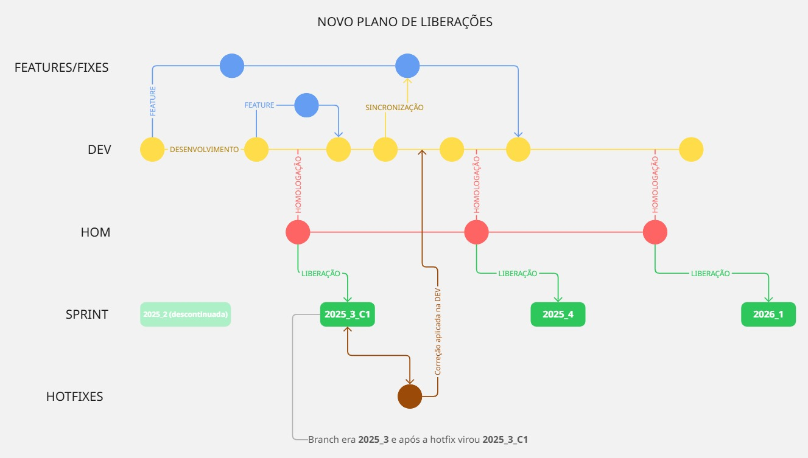

# 💻 SISPRO V6 🏢

Esta organização centraliza todos os repositórios de projetos da V6 que estão sendo desenvolvidos utilizando Git como sistema de controle de versão.
Link para documentação de componentes e processos internos aqui: [InfraCodeDocs](https://siscandesv6.sispro.com.br/SisproErpCloud/InfraCodeDocs/inicio)

## Linguagens e ferramentas utilizadas

- **Angular 19**
  - SCSS
  - HTML
  - Bootstrap
  - Javascript / Typescript
- **.NET Framework 4.8**
  - C#
- **Microsserviços**
- **Bancos de dados**
  - SQL Server
  - Oracle
  - SQLite
- **Cloud**
  - Azure (em crescente adoção)

> [!WARNING]
> A organização de branches dos repositórios **deve** seguir o padrão estabelecido. É fundamental padronizar a utilização das branches desde o início para evitar problemas de versionamento.

## Produtos e projetos atualmente sendo desenvolvidos
*Os nomes podem não refletir exatamente os nomes dos repositórios*

- **Corporativo**
- **Infra**
  - ConfigERP
  - PrePortal
  - ErpCenter
  - infra-code-docs
  - ngx-sp-infra
  - ngx-sp-auth
- **Contratos**
- **PortalRH**
- **Folha**
- **Patrimonio**
- **Contábil**
- **Fiscal**
- **Reinf**
- **Estágio** (versionado)
- **ERP**
  - Financeiro
  - Recebimento
  - Vendas
  - Compras
  - Estoque

## Links úteis

- [Design System (Figma)](https://www.figma.com/design/WoHZSAQsjqZuc6rC02CAkR/Sispro-DS---Definitivo?node-id=73-16002)
- [Documentação Angular](https://angular.dev/)
- [Azure Documentation](https://docs.microsoft.com/azure/)
- [.NET Framework Documentation](https://docs.microsoft.com/dotnet/framework/)
