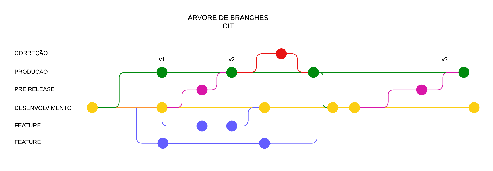

<h1 align="center"> 💻 SISPRO V6 🏢 </h1>
Esta organização alocará todos os repositórios de projetos da V6 que estão atualmente sendo desenvolvidos, o objetivo é que com o tempo migremos totalmente para a utilização do Git para os projetos V6, abandonando a versão atual do SVN

### Linguagens e ferramentas utilizadas
- Angular 17+
  - Sass
  - HTML
  - Javascript / Typescript
- .NET (futuramente .NET Core)
  - C#
- Microsserviços
- SQL Server / Oracle / SQLite
- Azure (futuramente)
- AWS

> [!IMPORTANT]
> Apenas alguns projetos seletos já estão utilizando git, pois algumas decisões importantes ainda estão tramitando nos bastidores. Logo logo teremos todos projetos V6 com seus repositórios por aqui!

> [!WARNING]
> Que fique documentado que a organização de branches dos repositórios **deve** ser feita desta maneira. Vamos padronizar a utlização das branches desde o início para não haver problemas de versionamento

### Produtos e projetos atualmente sendo desenvolvidos *(não necessariamente reflete o nome dos repositórios)*
- Corporativo
- Infra
  - NgxSpInfra (versionado)
  - SpIntegrations (versionado)
- Contratos
- PortalRH
- Folha
- Patrimonio
- Contábil
- Fiscal
- Reinf
- Estágio (versionado)
- ERP
	- Financeiro
	- Recebimento
	- Vendas
	- Compras
	- Estoque

### Anexos úteis
[Design System (Figma)](https://www.figma.com/design/WoHZSAQsjqZuc6rC02CAkR/Sispro-DS---Definitivo?node-id=73-16002)
